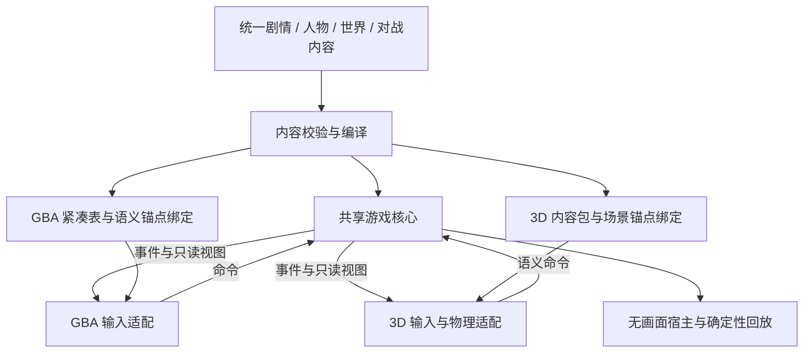

# 工程架构设计

## 一个游戏核心，多个平台适配层

本次根据用户的 3D 开放世界目标修订：共享核心在 `core/`，平台接入在 `adapters/`。剧情、人物、战斗、羁绊、养成、背包和世界进度不再规划为 RHH 内部功能。RHH 降为 GBA 前端/宿主候选及已有行为的迁移参考；未来 3D 前端调用同一核心，而不是重写这些规则。

共享逻辑优先采用可独立编译的 C99 子集：固定宽度整数、显式状态、受控内存、确定性随机、命令/事件接口。不依赖 OS、显示、音频、RHH 全局结构或 3D 引擎 SDK。语言是当前架构选择，具体 ABI 与工具链在最小宿主实现时冻结。GBA 构建将核心、紧凑内容表和平台适配静态链接为 `.gba`，不在机器上解析 JSON。

### 规划的职责映射

| 平台无关真源或规格 | 共享核心模块（规划） | 职责 |
|---|---|---|
| `content/regions/`、世界地点 | `core/world` | 地区、地点拓扑、访问条件与语义锚点 |
| `content/quests/`、对白图 | `core/story` | 条件、分支、状态机、一次性奖励 |
| 人物、关系、训练师 | `core/characters` | 稳定人物身份、关系、阵容与行为意图 |
| 物种、招式、道具 | `core/catalog`、`core/progression` | 统一领域数据、成长、队伍和收藏 |
| `config/rulesets.json` | `core/battle` | 合法性、伤害、行动顺序与完整结算 |
| `config/difficulty.json` | `core/ai`、`core/progression` | 阵容档位、思考预算与战外辅助 |
| `config/bond.json` | `core/bond` | 关系解锁、临时形态与战斗额度 |
| AI 规格 | `core/ai` | 公开观察、信念与动作策略 |
| 存档规格 | `core/save` | 领域快照、字段版本与逻辑迁移；平台负责 I/O |
| `content/text/zh-Hans/` | 文本 ID；平台文本适配 | 共享文字，GBA 字库/3D 字体各自编译 |

以上路径是职责设计，不表示运行时已经实现。具体接口、状态所有权和 RHH 迁移顺序见 [跨平台核心契约](09-portable-core.md)。Porymap 可继续编辑 GBA 图块、碰撞与场景摆放，但不得成为共享剧情条件与奖励的真源；生成的桥接脚本仅传入语义命令和消费展示事件。

## 上游与本项目的关系

外层使用独立项目仓库。正式接入时将 `engine/pokeemerald-expansion` 作为项目引擎分支的固定 Git 子模块或明确锁定的嵌套仓库；不可只放不可追溯 ZIP 再手工补丁。当前 `.gitignore` 临时忽略未接入的引擎克隆；采用子模块时修改该规则。

上游更新只作用于 GBA 适配与尚未抽离的 legacy 域。流程：独立集成分支 → 合并目标版本 → 审计 ID/存档变化 → 战斗与跨平台一致性测试 → 隐藏信息测试 → 地区旅行回归 → 再升级 lock。不得定时自动追逐 master。每个域只有一个状态写入者，禁止 core 与 legacy 同时修改同一场战斗或任务。

## 地区 ID、地图与剧情

- 内容侧使用 `kanto.pallet_town` 一类稳定符号 ID，编译时映射到引擎索引。存档不依赖随数组排序变化的隐式编号。
- 共享世界只定义地点、连接和进入条件；GBA tile 坐标、3D transform/navmesh 属于平台场景绑定。核心接收 `enter_location`、`interact_character` 等语义命令。
- 不先假设地图 ID、map group 或 flags 可无限扩展。核对当前字段宽度、地图数量与编译工具；超过原字段容量时端到端升级，包含脚本、存档、飞行和 Porymap 配置。
- 为跨地区地图使用 Omni 自有 map group；建立明确入口/出口表，测试双向 warp、连接、逃脱绳、白屏、离场脚本与复活。
- 剧情使用章节状态机：未解锁 / 可进入 / 进行中 / 完成 / 后日谈；局部任务采用紧凑枚举而非每句对白一个永久 flag。
- 生成阶段检查未定义 ID、无效 warp、不可达目标、重复奖励、不可满足任务依赖和错误地区过滤。

## GBA 存档约束与共享语义

逻辑存档采用版本化、平台无关字段；GBA flash 布局和未来主机存储是各自的编码/设备层。跨平台迁移不是复制原始 `.sav`，需要显式转换、内容兼容检查和字段迁移。3D 独有外观或任务数据回迁 GBA 不得静默丢弃；不支持时拒绝或明确导出可兼容子集。详见 09 文档。

不能承诺“全图鉴可捕获”就自动等于“所有物种与所有形态能同时存入 PC”。先测定当前 `BoxPokemon` 大小、盒数、上游保存分区、冗余与磨损策略；再冻结活体图鉴收藏目标。

粗略量级例子：若每只持久化记录为 80 B，仅 1,025 只就约 82 KB；这只是条件估算，实际必须使用所选上游版本的 `sizeof`。任务、图鉴、伙伴数据、冗余存档和更多形态会继续消耗空间。不能直接把原版常见 128 KiB flash 全当作可用 payload。

建议：

1. 优先紧凑编码图鉴与任务；固定数组和位集，不序列化运行时指针。
2. 羁绊长期数据只存解锁/里程碑/稳定伙伴身份；战斗计数和临时形态不写成永久物种。
3. 稳定伙伴 ID 必须覆盖交换、孵化、克隆/复制数据、进化、放生和 PC 重排；避免仅用数组下标。
4. 存档头含版本、内容版本、规则版本、序列号、长度和校验；校验解决损坏检测，不宣称防篡改。
5. 迁移先验证旧数据，再写新副本，完成校验后切换有效槽；保留断电恢复路径。
6. 若全收藏与冗余无法在标准存档空间共存，先优化布局并实测；主机外仓库只能是明确披露的可选辅助，不能悄悄变成真机游戏必需品。

## GBA 的 ROM 与 RAM 预算

GBA ROM 硬上限 33,554,432 B；预警线和模块配额在首次构建后设置。这些约束不作为统一世界内容库或 3D 平台的全局上限。不可凭上游文档中的旧构建示例替代测量，也不把填充至 32 MiB 的文件长度当作真实 section 占用。

记录四份报告：链接段与符号占用、各地区新增资源字节、运行时堆/栈峰值、存档分区布局。初始目标是在可用空间内留出可量化余量，具体数字由实测冻结。

优先优化顺序：共用室内与道路图块 → 去掉重复资源 → 共享音色与音序 → 文本/字库子集 → 资源压缩 → 图块和地区加载缓冲复用。禁用全部后世代宝可梦虽能节省空间，但违背最终目标，不能作为最终验收的默认解决办法。

ROM 存放大量静态内容，RAM 只保留当前地图及必要邻接数据。压缩节省 ROM 会增加解压时间与缓冲需求，必须同时验证帧率和双打。

## 中文与音频

代码/策划文件用 UTF-8；构建时按固定 charmap 转换为引擎编码。建立宝可梦、招式、道具术语库及文本稳定 ID；字库做子集与缺字检查。测试 240×160 的菜单截断、双字节边界、昵称长度、控制码、选择框和存档中的字符串长度。

字体项目许可与转换产物随附；中文显示需要引擎字形解码支持，不能仅替换 PNG。音乐和音效并发要与 AI 计算、解压共享真实帧预算。

## 真机联机

同版本本项目 ROM 的本地连线为后续目标；联机握手交换协议版本、规则哈希、物种数据版本和内容版本，不兼容就拒绝进入战斗。双方在同一回合快照决定动作后再统一结算。

上游 README 说明扩展项目不兼容官方原版联机；本项目也不能承诺无验证地兼容所有其他 RHH 改版。联网大厅与跨模拟器互联网匹配不属于普通 GBA 原生能力，单列后期辅助功能。
