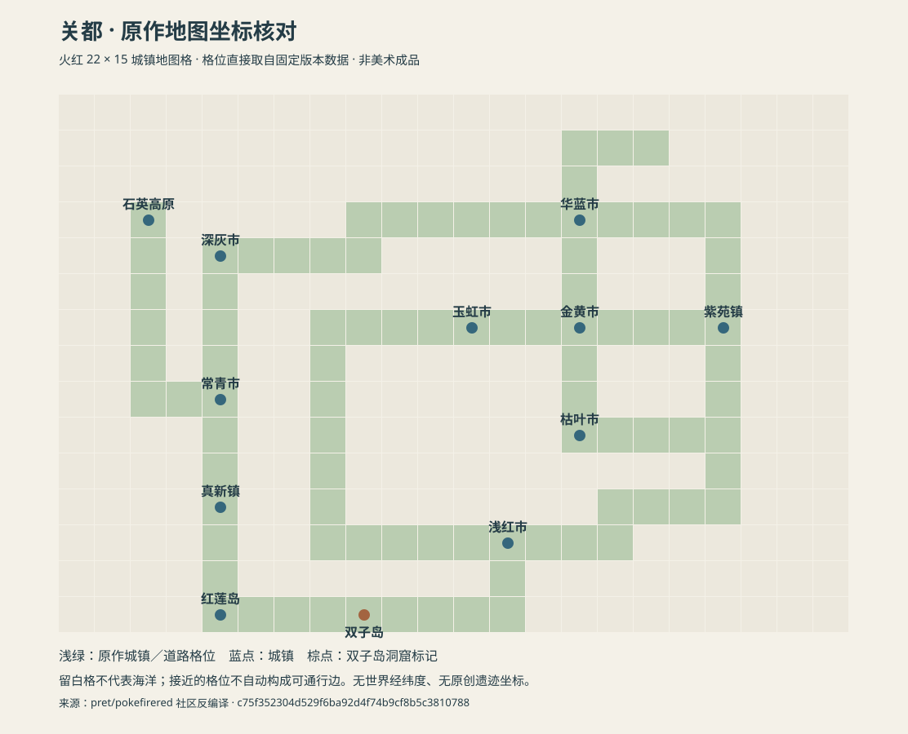

# 世界地图审计与制作依据 v0.2

2026-09-25 补充可视交付：[世界与人物设定集](story/README.md) 现在包含九个现代地区及洗翠的原作来源地图，可在 [本地世界地图页](http://127.0.0.1:4180/) 查看和放大。这是分幅图册；没有将未经证实的全球方位重新拼接为大陆图。来源登记在 `content/story/atlas.json` 和 `research/narrative/reference-media.json`。

2026-09-25。**撤回上一版 `omni-world-atlas-v1.png` 的地图制作参考资格。该图不是按原作地图校准的世界地图，禁止据此制作游戏地形、城市坐标、道路连接或剧情行程。** 保留旧文件仅用于追踪此次纠正，不再作为当前地图展示。

用户要求地图进入实际游戏。因此，“原创概念提案”的标签不足以弥补地理证据的缺失。上一版不仅拼接了未经确认的全球布局，还生成了各地区海岸与内部比例；目视核对地区名称不能验证地理正确。

## 审计结论

| 上一版内容 | 结论 | 现在如何处理 |
|---|---|---|
| 城都在关都西侧、两者陆路相连 | 原作关系可沿用，但生成图中的边界形状与比例未校准 | 地区连接需回到所选版本的道路和关卡；不用画作推导坐标 |
| 伽勒尔、卡洛斯、帕底亚在西侧排列；合众在东；阿罗拉在东南 | 本图自行安排，未取得足以证明这些全球相对位置的原作资料 | 撤销这些全球方位；不写入世界数据 |
| 丰缘与神奥的具体海峡、距离及其余陆块关系 | 没有经过可用于制图的原作尺度验证 | 不从现实日本、欧洲、美洲的取材关系推出游戏世界坐标 |
| 九地区的海岸形状、城镇间距、远洋航线 | 生成画面，不能作地图测绘依据 | 全部退出生产参考；逐地区采用原作版本地图 |
| 洗翠作为神奥的历史附图 | 历史关系成立；它不是另一个现代大陆 | 使用神奥历史时代层，具体地貌变化仍须核对《阿尔宙斯》 |
| 标为 1943 年的图中出现人工岛等现代设施 | 没有验证该时期是否存在 | 历史地图只展示有本作年代记录的设施 |
| 红莲岛旁的事件菱形、新增海域名称 | Omni 原创提案，没有原作位置证据 | 移除固定坐标；遗迹保持为待选址的剧情场景 |

本次没有取得一张覆盖全部目标地区、足以锁定它们全球坐标的官方总图。这不等于证明官方从未发布过任何世界图。暂时未知的关系必须保持未知，不能用一张好看的拼图代替验证。

检查项目的内容、运行时代码、资源编译与服务脚本，没有发现旧概念图被游戏或构建流程引用。当前真新镇等场景通过 `tools/build_pallet_assets.py` 使用《火红》来源地图；这次审计没有把旧概念图转换成新游戏场景。

## 已完成的关都来源核对

关都采用《火红》作为本轮坐标基准，与当前真新镇素材流水线使用同一固定来源提交：

`pret/pokefirered@c75f352304d529f6ba92d4f74b9cf8b5c3810788`。

这是社区对游戏数据的反编译重建，**不是官方公开的源码**。其价值在于可定位原游戏的格位、地图连接与入口记录，证据等级不能与官方网站混写。



- 导出了关都城镇地图的两个完整 22 × 15 格位层：城镇／道路层和洞窟标记层。
- 保存了真新镇、二十一号水路南北两段、红莲岛、二十号水路、双子岛一层、十九号水路和浅红市共八张地图的连接与传送入口记录。
- 确认真新镇位于红莲岛以北；真新镇南出口连接二十一号水路北段，红莲岛东出口连接二十号水路。双子岛位于红莲岛以东的这段水路范围。
- 九份来源文件均记录固定提交、原始 URL 和 SHA-256。核对图直接由格位生成，没有手绘新的海岸。

复现及验证：

```powershell
python tools/audit_kanto_geography.py
python tools/audit_kanto_geography.py --check
```

数据见 [关都参考清单](../research/geography/kanto-reference.json)，脚本见 [核对工具](../tools/audit_kanto_geography.py)。下载缓存位于 `.cache/geography/`，不提交。

**范围限制：** 这是一张用于核对的城镇地图格位图。留白格不能解释为海洋，相邻格不能直接解释为可步行连接；八张地图的元数据也不是完整关都通行图。洞窟内部层数、碰撞、水路能力要求、事件开关和全部出入口仍须逐场景验收。SVG 不是最终美术，也不是已经编入 ROM 的地图。

## 游戏地图的制作规则

1. **地区内部以选定原作为基准。** 先记录来源版本、地名、城镇和道路坐标、出入口，再适配 GBA 与未来 3D。版本有差异时明确取舍，不能把不同年代的路线拼成一个未经说明的结果。
2. **全球位置与旅行关系分开。** 尚未核实的世界坐标为空；有原作依据的相邻和旅行关系逐条记录。跨地区航运可以设计，但新增路线必须标为 Omni 内容，不能反过来作为官方地理证据。
3. **历史时期单独表达。** 洗翠和神奥是同一地区的时代关系；1943 与小智时代的关都也需要分别记录设施、边界与事件状态。官方现代地图不能自动证明某座研究院在前史中已经建成。
4. **原创场景附着于已核对的局部地图。** 红莲事件洞窟先保留“红莲近岸”语义位置，待关都南部场景可检查后再确定入口、撤离路线、可见海岸与接应点。不得移动双子岛或堵断二十号、二十一号主水路来迁就剧本。
5. **同一地点 ID 跨平台复用。** 剧情引用地点和出口 ID，GBA 格位与 3D 世界坐标由适配器持有。未来三维扩展保留地区关系、交通与地标，不把二维城镇地图格当作真实米制比例。
6. **进入游戏前实际验收。** 来源核对、连接一致性、碰撞和入口、剧情访问条件、实机画面分别通过后才可称为可玩地图。地区选择界面不能代替地区内容。

上述为当前制作规范，不是已经接入构建器的自动拦截规则。现阶段其余地区尚未完成和关都同等粒度的地图数据审计；本次不宣称已完成全世界可玩地图。

2026-09-25 验证：`--check` 通过；畸形格位输入和错误来源哈希均被拒绝；JSON、SVG 语法与本轮文档本地链接通过检查；SVG 在 Edge 渲染后目视检查了地名、标记和说明文字。运行时／内容／构建源码未发现旧图引用。本次未更改游戏运行时，未重新构建或测试 ROM。

## 可用的一手地区资料与证据边界

| 来源 | 可以支持什么 | 不能据此推出什么 |
|---|---|---|
| [官方《心金／魂银》](https://www.pokemon.co.jp/game/ds/hgss/) | 城都旅程与后续关都访问背景 | 全世界精确经纬度、海路里程 |
| [官方 Let's Go 关都介绍](https://pokemonletsgo.pokemon.com/en-us/kanto-region/) | 真新镇、大木与关都地标背景 | 与《火红》逐格完全一致 |
| [官方 ORAS 丰缘地区图](https://www.pokemon.co.jp/ex/oras/feature/02.html) | 丰缘东西延展的主岛、群岛与地区轮廓参考 | 丰缘与关都之间的精确全球方位及距离 |
| [官方《剑／盾》伽勒尔地区图](https://www.pokemon.co.jp/ex/sword_shield/story/190605_01.html) | 伽勒尔内部布局参考 | 伽勒尔与卡洛斯、帕底亚必然接壤 |
| [官方阿罗拉回顾](https://www.pokemon.com/us/pokemon-news/celebrate-25-years-of-pokemon-with-memorable-moments-from-the-alola-region) | 四座主要自然岛及人工岛的现代背景 | 人工岛在本作 1943 年存在，或阿罗拉在关都东南 |
| [官方《阿尔宙斯》故事](https://legends.arceus.pokemon.com/en-us/story/) | 洗翠后来称为神奥、天冠山的地区地位 | 现代与古代每个地点无变化 |

关都与城都的接壤关系另参考 [Johto 社区资料](https://bulbapedia.bulbagarden.net/wiki/Johto)，正式双地区地图还须核验实际版本中的二十七号道路、都城瀑布等连接，不以社区描述替代关卡数据。

## 旧图归档

旧文件：`assets/concepts/omni-world-atlas-v1.png`，SHA-256 `e648183a7d56e24528f770395e69affaa5de0d4e9eb490085a01e801fe5fa93a`。其 [生成提示词](../research/narrative/2026-09-24-world-atlas-prompt.md) 与 [撤回记录](../assets/concepts/README.md) 保留，用来追踪哪些内容曾经被错误地当作地图提案。禁止把该文件标为官方校准版、精确世界图或游戏地图底图。
