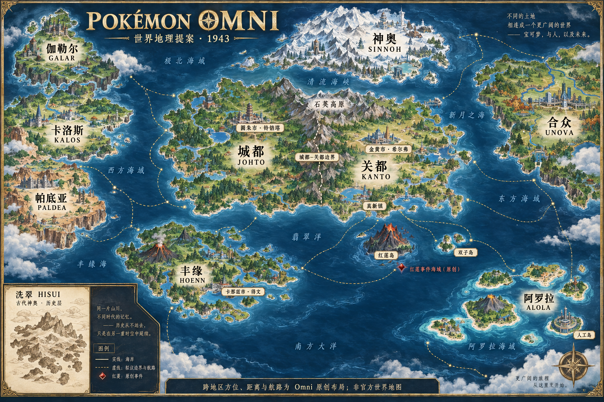

# Omni 世界地图 v0.1

2026-09-24。依据用户九个现代地区与古代洗翠的范围绘制。成品是世界设定概念图，供剧情地理讨论；没有生成可玩地图、GBA 图块、精确海岸数据或经过确认的各国边界。

## 使用方法与依据

图题“1943”表示红莲事件的工作年代。图上的建筑风格是概念表现，不是 1943 年各地区城市建设或政权版图已经定稿。北方在图上方，距离不按比例，未规定航行时间。

| 地理要素 | 本图安排 | 来源与性质 |
|---|---|---|
| 城都与关都 | 同一陆块，城都在西、关都在东 | 沿用原作地理关系；本次用 [Johto 条目](https://bulbapedia.bulbagarden.net/wiki/Johto) 交叉核对，属于社区资料 |
| 神奥 | 位于关都、城都以北 | 方位有上述资料支持；本图海峡宽度、海岸形状为概念设计 |
| 丰缘 | 位于中心陆块西南的海洋地区 | 本图的全球落位提案，不宣称这一距离与海上边界得到官方确认 |
| 伽勒尔、卡洛斯、帕底亚 | 布置于西部；伽勒尔在北、帕底亚在南 | Omni 布局提案，不以现实欧洲地图证明宝可梦世界的确切相邻关系 |
| 合众 | 东部远方陆块 | Omni 布局提案，没有声称官方认定它位于关都正东 |
| 阿罗拉 | 东南部海上群岛 | 全球方位为提案；人工岛只作为轮廓元素，不能推断以太基金会于 1943 年已存在 |
| 洗翠 | 左下历史附图，与神奥关联 | 官方明确洗翠后来称为神奥；不是第十个并列现代地区。[官方故事页](https://legends.arceus.pokemon.com/en-us/story/) |

本轮没有找到一份可直接作为九地区统一精确底图的官方坐标资料，因此没有将网上粉丝拼图包装为官方世界地图。图中具体海岸、山峰数量、远洋路线和新增海域名称均属于概念绘制；精确城镇位置仍应在后续地区图中以相应原作地图校准。

## 与当前故事有关的地点

| 地点 | 前史用途 | 地理与剧情边界 |
|---|---|---|
| 真新镇 | 大木个人研究、后来的小智出发地 | 位于关都；原作地点，本图只画概略节点 |
| 圆朱市／铃铛塔 | 坂木寻医、追寻凤王传说 | 官方动画简介确有到圆朱市寻找凤王的情节；羽毛治愈叉字蝠属于 Omni。[官方剧集简介](https://www.pokemon.com/us/animation/seasons/23/episode-9-finding-a-legend) |
| 金黄市／希尔弗 | 企业资助、研究院和资本政治中心 | 原作地点与公司位置，本作新增研究院及政治角色；参考 [希尔弗条目](https://bulbapedia.bulbagarden.net/wiki/Silph_Co.) |
| 石英高原 | 冠军与联盟竞技中心 | 原作地点；政府是否把首都设在这里尚未决定，图标不代表首都 |
| 红莲岛及周边海域 | 夏伯、红莲事件 | 岛屿来自原作；红色菱形表示本作原创事件位置，不是官方神兽栖息地 |
| 双子岛 | 红莲岛以东的地理参照，也可联系西野森五世的动画登场 | 游戏岛屿和动画场景表现有差别，本图不证明研究所具体坐标。[角色资料](https://bulbapedia.bulbagarden.net/wiki/Professor_Westwood_V) |
| 卡那兹市／得文 | 希尔弗谈判中的潜在竞争资助方 | 官方动画把得文情节放在卡那兹市背景下；本作跨地区科研关系另写。[官方剧集简介](https://www.pokemon.com/uk/animation/seasons/6/episode-17-stairway-to-devon) |

前史有一个自然形成的政治条件：坂木从关都前往城都的圆朱市寻医，本来就跨越地区。在各自为政的设定下，需要有商旅、民间往来或通行制度，而不是一有摩擦所有边境就完全封闭。本轮只指出该条件，不新增已经发生的边境事件。

“红莲事件海域”是近海事件标记，尚未确定遗迹结构、入出口和救援位置。它不自动替代用户早先提到的关都—城都边境炎帝事件地点；两起事件必须分别布置。

## 后续地理约束

- 区分大陆连接、海路、历史时空通道；洗翠不通过普通航线连接到“另一个神奥”。
- 原作现代关都、城都共享联盟的关系，与本作 1940 年代的分治是不同制度状态；这是一条需要后续写出的历史变化，不是地图画出边界便完成解释。
- 所有九个地区出现在世界图上，不等于全部参与同一场“内战”。共同政治体范围、域外介入者和中立地区仍待定。
- 图上新增海域名与装饰文案暂不进入世界数据。图中金色航线只是交通构想，不表示既定开放顺序、军事部署或玩家解锁路线。

## 资产与生成

- 成品：`assets/concepts/omni-world-atlas-v1.png`，1536 × 1024。
- 内置 image_gen 生成，使用 imagegen 技能；没有使用 CLI/API fallback。
- [完整生成提示词](../research/narrative/2026-09-24-world-atlas-prompt.md)。
- SHA-256：`e648183a7d56e24528f770395e69affaa5de0d4e9eb490085a01e801fe5fa93a`。
- 已目视检查九地区标签、城都与关都陆地连接、洗翠历史附图及原创说明。未宣称地区内部细节与原作逐城镇完全一致。
