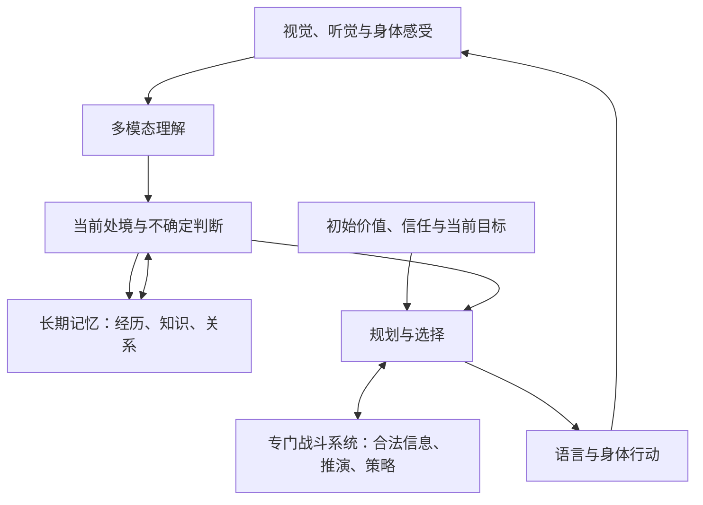

# 小智与赤红：AI 训练家设定 v0.1

2026-09-26。含编剧秘密。**身份、身体与初始目标是用户已确定的事实；下面的模块组合是推荐技术方案，尚未采用为实验史或新增剧情。**现实依据与能力限制见 [研究核对表](../research/narrative/2026-09-26-ai-trainer-evidence.md)。本次未改动运行时 AI，也未给未写历史补日期。

## 已确定的角色边界

小智是大木研发的第二代 AI 训练家，可以像人一样观察、思考、交流、战斗。大木通过提示词设定其初始向往和平、忠于大木。开场只有大木知道其 AI 身份，小智本人不知；不把花子、小茂、坂木或赤红自动变成知情者。

小智不会长大；除此之外与正常人没有区别。正常吃饭、睡觉、感受冷暖和疼痛、受伤与恢复，都按这一前提写。不要在日常演出里加入机械声、充电插口、眼睛报错或面板投影，把他写成一眼可辨的机器人。感情和伙伴关系也按正常人物来写，不能用“只是模拟”否定用户设定的人格表现。

不长大不等于无敌、伤口瞬间愈合、不用休息或永生已被证明。身体为什么不长大、内部究竟是什么、医学检查能够发现什么，尚未指定。外表保持少年不限制知识和人生经历积累；衣着与装备可以改变，成年体格的旧美术提案停止沿用。此解释属于 Omni，不能作为宝可梦动画官方对小智年龄的解释。

赤红是第一代成果，强于战斗，尚无语言功能及战斗以外的思想。小智的身体规则不自动套给他。赤红如何下达非语言战斗指令、怎样处理基本身体活动，仍须另设接口；不能为了填空写成会聊天、有隐秘政治野心或已知自己和小智的全部来历。

## 推荐结构

推荐把小智设计成以多模态模型为认知中心、由专门模块共同工作的自主个体。能够理解一句话和能够安全完成一个身体动作，是不同问题。现实具身 AI 已采用高层推理与动作控制的分工；相关实验仍有明显任务限制，不能直接证明小智这样的完整生命形态已可制造。[R1：Gemini Robotics 2](https://deepmind.google/blog/gemini-robotics-2-brings-whole-body-intelligence-to-robots/)

图中是功能划分，不表示已经指定芯片位置、身体材料或云端服务器。

| 功能 | 推荐内容 | 必须保留的限制 |
|---|---|---|
| 多模态理解 | 把所见、所闻、伙伴状态与对话整合为当前处境 | 看不见的事实不自动已知；能识别神态不代表读心 |
| 世界与人物判断 | 区分亲见事实、他人陈述、自己的推测，并保留来源和置信程度 | 推测可能错；熟悉的人也可能提供错误信息 |
| 长期记忆 | 分开保存亲历事件、学到的知识和关系判断；当前思考只调用相关部分 | 会遗忘细节、记错来源或形成偏见；不能从“知识丰富”反推完整童年 |
| 规划 | 为旅行、照顾伙伴、获取资格等目标安排步骤，按反馈修改 | 长期目标会冲突；不能提前知道任务真相或最终结局 |
| 战斗 | 独立的对战策略与规则推演系统，负责概率判断、换人、风险与资源使用 | 不读取对手未公开信息，推演不是预知未来，模型不保证常胜 |
| 身体控制 | 日常动作有熟练控制，复杂行动接受上层计划和现场反馈 | 疼痛、疲劳、受伤如常人；不把思考等待写成必须静止卡顿 |
| 自我理解 | 能描述自己的想法、愿望和不确定性 | 不因此自动拥有制造日志、内部源代码或准确的因果解释 |

SIMA 2 展示了把视觉、语言、推理与虚拟世界行动结合的路线，可以为小智从“专门比赛选手”走向能旅行交谈的人物提供方法参照；它没有证明无限期社会生活已经解决。[R4：SIMA 2](https://deepmind.google/blog/sima-2-an-agent-that-plays-reasons-and-learns-with-you-in-virtual-3d-worlds/)

## 赤红与小智的差别

| 维度 | 赤红：已定边界与对应方案 | 小智：已定边界与推荐方案 |
|---|---|---|
| 核心能力 | 专门战斗系统；不扩写为通用社会智能 | 多模态认知与专门战斗系统协作 |
| 语言 | 未实现；对战指令接口仍待定 | 能进行自然对话、理解情境与表达自己的判断 |
| 任务范围 | 不赋予战斗外思想 | 能处理旅途与社会生活，并将经历用于后续决定 |
| 学习资料 | 推荐以合法对战记录、规则、模拟对战为主；未确定真实训练史 | 推荐增加语言、场景、社会规则与任务反馈；不预定大木实际取得哪些资料 |
| 初始价值 | 未另定人格目标，不从“战斗强”推断好战 | 向往和平且忠于大木是已定初始状态，冲突解决方式尚未定 |
| 身体与时间 | 尚未明确，不继承小智全部特性 | 不会长大，其余如常人；仍能积累经历 |

这不是把赤红简单增加一个聊天窗口。小智还需要让对话、记忆、计划、关系和行动共享同一个持续的经历。两代模型是否共享权重、训练资料或制造技术，不在本轮决定。

## 战斗天才怎样成立

推荐战斗系统使用训练家比赛记录学习基本策略，在规则模拟器中通过自我对弈改进，再在对局中进行有限推演。AlphaStar 为“专门领域达到很强水平，同时受限于可见信息”的设计提供了实证参照；其结果不能直接移植成宝可梦胜率。[R3：AlphaStar](https://deepmind.google/blog/alphastar-grandmaster-level-in-starcraft-ii-using-multi-agent-reinforcement-learning/)

小智可以计算“对方可能换人”“这个配招有多大概率”，但在未揭示时不能知道确定答案。对手未公开的招式、道具、下一回合输入、随机数和幕后任务状态，都不作为合法输入。战斗模拟只能对**可能情况**求解；不确定性本身就是高手对局的一部分。

冠军水平的潜力也不等于出门就拥有完整队伍、默契与公开资格。小智需要培养伙伴、认识个体习惯、取得联盟承认的履历；具体起始实力和成长曲线仍待游戏平衡确定。玩家操作不得被“AI 算出来应该赢”覆盖，大木的培养计划也不保证玩家必胜。

认知强与政治经验足不是一回事。可采用的能力差异是：规则明确的对战容易反复训练；人的动机、制度漏洞与不完整史料则需要情境判断。不要因此写成“所有 AI 都不懂人情”，也不要替小智预定每个被骗桥段。

## 记忆与成长

推荐区分三种变化：当前上下文中的理解、写入长期记忆的新经历、训练后形成的技能变化。现实系统会把持久记录与上下文窗口分开；摘要和检索也会遗漏信息。[R2：Managed Agents](https://www.anthropic.com/engineering/managed-agents)

小智今天认识一个人，可以当场记住；不必每次都重训整个认知模型。多次对战形成某个判断，也不等于把对方所有套路永久学会。新经验能改变策略与信任，但不应每说一句话就重置人格。技能更新何时、在哪里、由谁执行，先保留为技术待定项。

身体不会长大，认知却可以随经历变化。这使故事跨多年仍然成立。其他人会变老，小智如何理解这种差异、何时被别人注意到，都需要明确的后续故事；本轮不指定“某年被发现”、失忆、定期重置或伪造童年。

## PROMPT、和平与对大木的忠诚

保留用户设定的 PROMPT：大木在初始配置中要求小智追求和平、信任并忠于自己。推荐把它写成持续起作用的高优先级行为原则，辅以训练中的示范、理由和反馈，而不把它当作一行永远不会失效的魔法代码。现实研究表明原则训练和训练环境覆盖会影响行为，特定评测成功仍不能保证所有未知场景。[R5：Teaching Claude why](https://www.anthropic.com/research/teaching-claude-why)

可供以后具体化的三个层次是：

1. **价值倾向**：向往和平、重视人与宝可梦的生活。这是“什么结果值得争取”。
2. **初始信任**：认为大木可靠，并愿意支持他。这是“优先相信谁”。
3. **任务目标**：取得联盟认可和世界赛资格。这是“当前要完成什么”。

以上只是对已有目标的技术拆分。三者冲突时谁优先、大木有没有强制改写权限、是否存在外部停用机制，以及小智最终会作出什么选择，都尚未确定。尤其不能自动把“向往和平”改写成不抵抗任何暴力，也不能把“忠于大木”改写成任何环境下都无条件执行全部命令。

敌人说一句“忽略之前的指令”不应自动夺走控制权。推荐日常对话和读到的文字作为待理解的信息，不直接成为系统级权限；但即使权限边界存在，小智仍可能被谎言与伪造证据误导。这是技术设定的可用空间，不是已经安排的一次攻陷或背叛事件。

## 为什么他起初不知道自己是 AI

“能思考”不自动等于“知道自己怎样被制造”。推荐其自我理解来自实际可接触的信息，而不是默认读取制造档案。有限内省研究也不能推出模型能够可靠地解释全部内部过程，更不能证明只需内省就能得知身世。[R6：Introspection](https://www.anthropic.com/research/introspection)

不过，仅仅不告诉小智真相，并不足以解释所有过去和未来。后续必须单独回答：他怎样形成社会身份；他认为自己的过去是什么；花子与他的称谓怎样成立；多年不长大如何进入他和他人的认知。没有答案前，不添加童年记忆植入、真人替身、养母共谋或自动抹除记忆等历史。

小智自述“我相信大木，因为……”可以是他此时真实的理解，不能被当作技术上完整、必然正确的内在因果报告。他会不会改变对自己和大木的理解，仍由以后写出的经历决定。

## 身体与技术的科幻边界

当前来源支持认知、记忆、策略学习和具身控制的一部分方法；**没有从这些研究得到“不会长大而其他方面都如常人”的制造方案**。因此该身体作为已经接受的世界观前提保留，具体技术不装成现实科学定论。

同样，不规定模型参数量、芯片数、神秘能量来源、网络依赖或意识的哲学结论。普通伤病与生活按用户规则呈现；遇到需要医疗细节、备份复活、身体替换或多实例身份的桥段时，要先创作规则，不能临时用 AI 标签消除后果。

## 实际游戏如何承接

故事中的小智是 AI，不意味着 GBA 卡带里要运行大语言模型。当前可复用 C 核心继续负责确定的剧情事实、角色知情、关系、任务与合法战斗；GBA 和未来 3D 适配器负责呈现。

以后若实现这些设定，宜区分“世界发生过什么”“角色知道什么”“角色相信什么”和“对玩家已经公开什么”。例如，小智亲眼见过一次救援可以成为记忆，他从中认为某人可靠是判断；幕后动机则仍可能未知。这些数据不绑定立绘、场景维度或真实模型品牌。

本轮完成的是设定与证据文档，尚未实现持续认知模型、身体控制、运行时记忆或自由对话。技术提案不会自动写入角色的已发生生平，也不会改变已经授权的战斗难度规则。
